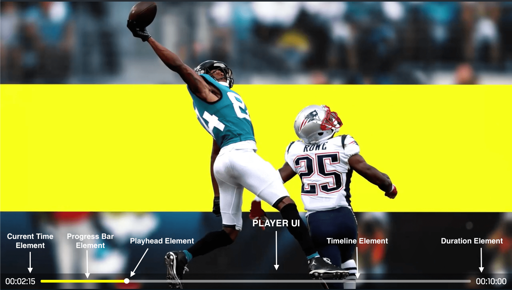

# DAZN Front-end Code Test

**Welcome to DAZN!**

The following project is a mini React application comprising a simplified version of part of DAZN's user interface and its associated API.

The application consumes JSON data from a mock API endpoint, renders it into a UI, and provides basic interactivity enabling a user to browse the content.

## What We Want You to Do

Firstly, there are **two** bugs that we'd like you to find, debug and fix. 

To help you debug the application, a collection of [user stories](#expected-behaviour) has been included below which fully describe the intended behaviour of the application. There is *one* bug relating to the rails feature and *one* bug relating to the image lazy loading feature described in the user stories.

We expect you test the bug fixes you make using the [unit test tooling](#testing) provided.

After fixing the bugs, we'd like you to implement and write tests for the `Player UI` feature as per the [design](#player-ui-design).

## Take Home Test

If you are doing this test as a take-home test, we expect the bug-fixing portion of the test to take you an hour or so and a similar amount of time for the player UI feature.

If you'd like to spend a bit more time improving, refactoring, or adding extra features, that's great - but its not a requirement.

Please initialise a Git repo in the test root and push your repo to a *private* GitHub repository. You should commit your work frequently with clear messages and open pull requests for your changes as appropriate, so we can see how you work. Once you are finished with the test, add your reviewers as collaborators to your *private* GitHub repository.

A `candidate-readme.md` has been included for you to include any notes about your work, you would like your reviewers to see. If there are areas you wanted to work on but didn't have time, this would be a good place to note them down.

## On-site Test

If you are doing test on-site, you will have 90 minutes to spend on the test, either on your own or as a pairing exercise.

Please take as much time as you need to familiarise yourself with the codebase, get the application running, and identify the bugs.

Once you're up and running, start with the the bug-fixing portion of the test and then move on to the player UI feature. If you complete the feature with time remaining, you may then want to come up with a plan of how you intend to spend the rest of your 90 minutes and which part or parts of the application you would like to focus on. We recommend focusing on an area or areas where you can best show your strengths and ability.

Once the 90 minutes are up, your interviewers will take 15 minutes alone to review, before reconvening with you to talk through your work.

If there are areas you wanted to work on but didn't have time, please note them down so that we can discuss your ideas afterwards.

## Getting Started

Firstly, install the project dependencies:

```
$ npm install
```

#### Development Environment

A fully working development environment has been provided to make things as simple as possible for you.

To start the development environment, run:

```
$ npm run dev
```

This will start up a webpack dev server with hot module reloading, and a mock API endpoint providing JSON data to the application.

The development server will be available at **[http://localhost:3000](http://localhost:3000)**

#### Testing

A fully working testing environment has been included which uses [Mocha](https://mochajs.org/), [Chai](https://www.chaijs.com/), [Enzyme](https://github.com/airbnb/enzyme/) and [Sinon](https://sinonjs.org), along with one passing example test.

To run tests, run the following script, and all files ending in `.test.js` will be evaluated:

```
$ npm run test
```

#### Prettier

Additionally, the [Prettier](https://prettier.io/) code formatter has been included which will automatically format your JavaScript and CSS code on save while running the development environment. We hope that this will speed up your development and allow you to focus on writing code, rather than style and formatting. However, we appreciate that this might be distracting and unfamiliar, so you may run `$ npm run start` instead to start the dev server only, without prettier.

## Important

Please focus your time on the client side. The included dev server is intentionally simple and may look like a good candidate for improvement. However, this is a front-end interview and we are primarily interested in your skills in the following domains:
- JavaScript
- DOM & Browser Environment
- CSS
- HTTP & API Integration
- Debugging & Testing
- Code Organisation
- Performance & Optimisation

If you are planning to add additional functionality, please try to avoid adding libraries, as we want to see you implement as much as possible yourself.

If you are stuck or confused about anything, please contact your interviewers for help as soon as possible so we can get you back on track and make the best use of your time.

Finally, please feel free to Google anything you need.

Good luck!

## Expected Behaviour

- [Feature: Rails](#feature-rails)
- [Feature: Image Lazy Loading](#feature-image-lazy-loading)
- [Feature: Selecting a Tile](#feature-selecting-a-tile)
- [Feature: Player UI](#feature-player-ui)

##### Background
<pre>
<strong>Given</strong> I am a user of the application
  <strong>And</strong> I have successfully loaded the application
</pre>

### Feature: Rails

<pre>
 <strong>I want</strong> to see relevant content displayed in a categorised system of "rails" and "tiles"
<strong>So that</strong> I can easily navigate and find the content I want
</pre>

##### Scenario: Rail content off screen to the right
<pre>
<strong>When</strong> a rail has more content than will fit on screen
 <strong>And</strong> there is content hidden off screen to the right
 <strong>And</strong> I hover anywhere within a rail
<strong>Then</strong> a "scroll right" button will be shown at the right edge of the rail
</pre>

##### Scenario: Rail content off screen to the left
<pre>
<strong>When</strong> a rail has more content than will fit on screen
 <strong>And</strong> there is content hidden off screen to the left
 <strong>And</strong> I hover anywhere within a rail
<strong>Then</strong> a "scroll left" button will be shown at the left edge of the rail
</pre>

##### Scenario: Clicking on the "scroll right" button of a rail
<pre>
<strong>Given</strong> that a rail's "scroll right" button is visible
 <strong>When</strong> I click on the button
 <strong>Then</strong> the rail's content will be moved to the left
      revealing additional tiles to the right
  <strong>And</strong> the next tile which is partially or fully hidden
      to the right will become the left-most fully visible tile
</pre>

##### Scenario: Clicking on the "scroll left" button of a rail
<pre>
<strong>Given</strong> that a rail's "scroll left" button is visible
 <strong>When</strong> I click on the button
 <strong>Then</strong> the rail's content will be moved to the right
      revealing additional tiles to the left
  <strong>And</strong> the left-most fully visible tile will become the
      next fully or partially hidden tile to the right
</pre>

##### Scenario: Reaching the end of a rail
<pre>
<strong>Given</strong> that there is content hidden off screen to the right
 <strong>When</strong> the total width of that content is less than the
      width of the viewport
  <strong>And</strong> I click on the "scroll right" button
 <strong>Then</strong> the final tile in the rail will move no further left
      than the right edge of the viewport
  <strong>And</strong> the "scroll right" button will disappear
</pre>

##### Scenario: Reaching the start of a rail
<pre>
<strong>Given</strong> that there is content hidden off screen to the left
 <strong>When</strong> the total width of that content is less than the
      width of the viewport
  <strong>And</strong> I click on the "scroll left" button
 <strong>Then</strong> the first tile in the rail will move no further right
      than the left edge of the containing rail
  <strong>And</strong> the "scroll left" button will disappear
</pre>

### Feature: Image Lazy Loading

<pre>
 <strong>I want</strong> to load only those images that are visible within the viewport
<strong>So that</strong> the app loads faster and my bandwidth usage is minimized
</pre>

##### Scenario: Loading the app
<pre>
<strong>When</strong> all rails have been rendered
 <strong>And</strong> some images are contained within tiles hidden off screen
<strong>Then</strong> only the images within tiles which are partially or
     fully within the viewport will be loaded and shown
</pre>

##### Scenario: Revealing content
<pre>
<strong>When</strong> an image is within a tile which is hidden off screen
 <strong>And</strong> that tile becomes partially or fully visible due
     to horizontal rail scrolling or vertical page scrolling
<strong>Then</strong> that image is loaded and shown
</pre>

##### Scenario: Hiding content
<pre>
<strong>When</strong> an image is already loaded and visible
 <strong>And</strong> its tile then becomes hidden off screen due to
     horizontal or vertical scrolling
<strong>Then</strong> the image will remain shown
 <strong>And</strong> the image will not be re-loaded if the tile is revealed again later
</pre>

### Feature: Player UI
<pre>
  <strong>I want</strong> to have a visual indication about my position in the video I'm watching
  <strong>So that</strong> I can understand how much of the video I have watched and accurately seek to a different position.
</pre>


##### Player UI Design


##### Scenario: Showing the Player UI
<pre>
  <strong>When</strong> a video is loaded by the player
  <strong>Then</strong> the Player UI will be visible
  <strong>And</strong> its background will be black and slightly transparent
</pre>


##### Scenario: Showing the Current Time Element in HH:MM:SS format
<pre>
  <strong>When</strong> a video is loaded by the player
  <strong>And</strong> the Player UI is visible
  <strong>Then</strong> I will see the Current Time Element
  <strong>And</strong> its value will be 00:00:00 in HH:MM:SS format
</pre>

<pre>
  <strong>When</strong> a video is playing
  <strong>And</strong> the Player UI is visible
  <strong>Then</strong> the Current Time Element will be updated so that it always reflects the current time of the video
</pre>
 

##### Scenario: Showing the Timeline Element
<pre>
  <strong>When</strong> a video is loaded by the player
  <strong>And</strong> the Player UI will be visible
  <strong>Then</strong> the Timeline Element will be visible
  <strong>And</strong> its background will be light dark
  <strong>And</strong> the Playhead Element will be visible and positioned at the start of the Timeline Element
</pre>

<pre>
  <strong>When</strong> a video is loaded by the player
  <strong>And</strong> the Player UI is visible
  <strong>Then</strong> the Progress Bar Element will be visible
  <strong>And</strong> its background will be yellow to indicate the time played
  <strong>And</strong> the Playhead Element will be positioned, so that it represents 
  the current point in time relative to the total duration of the video
</pre>


##### Scenario: Clicking on the Timeline Element, seeks video to that position
<pre>
  <strong>Given</strong> a video is loaded by the player
  <strong>And</strong> the Player UI is visible
  <strong>When</strong> I click at any point on the Timeline Element
  <strong>Then</strong> the video will seek to the corresponding point in time
</pre>

<pre>
  <strong>Given</strong> a video is playing
  <strong>And</strong> the Player UI is visible
  <strong>When</strong> I click at any point on the Timeline Element
  <strong>Then</strong> the video will seek to the corresponding point in time, and continue playing 
</pre>


##### Scenario: Showing the Duration Element in HH:MM:SS format
<pre>
  <strong>When</strong> a video is loaded by the player
  <strong>And</strong> the Player UI is visible
  <strong>Then</strong> I will see the Duration Element
  <strong>And</strong> its value will be the duration of the video in HH:MM:SS format
</pre>
